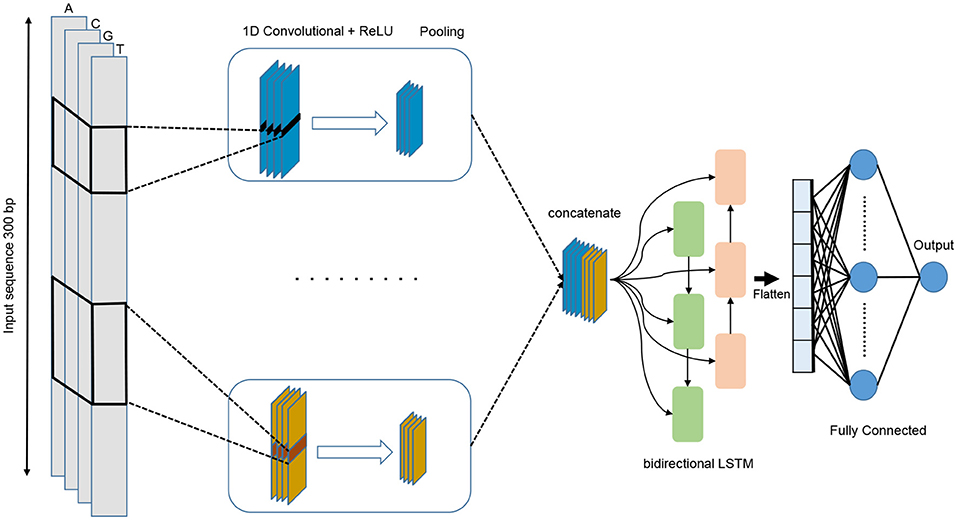

# Eukaryotic-Promoter-Recognition-using-CNN
DeePromoter combines a convolutional neural network (CNN) and a long short-term memory (LSTM). Additionally, instead of using non-promoter regions of the genome as a negative set, we derive a more challenging negative set from the promoter sequences. The proposed negative set reconstruction method improves the discrimination ability and significantly reduces the number of false positive predictions.

    

